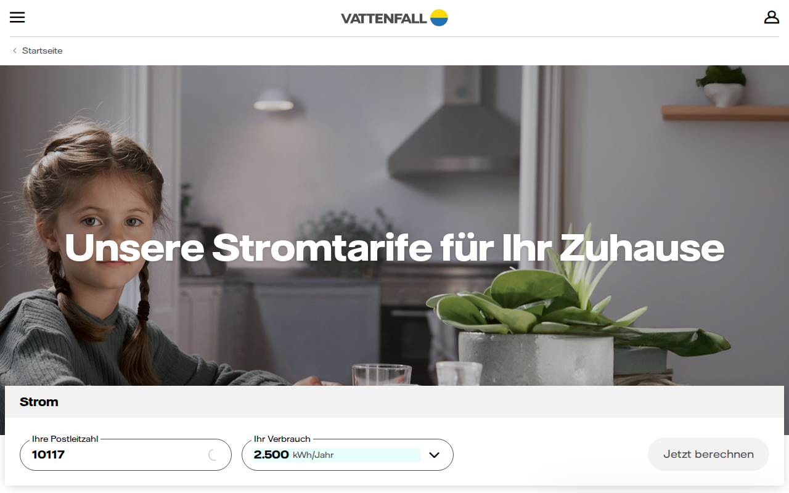
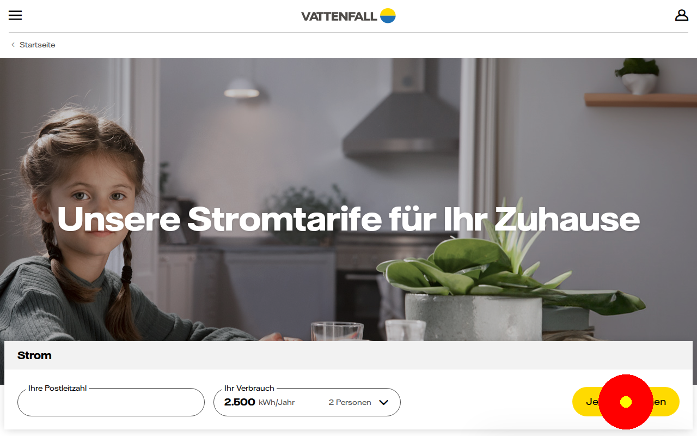

# Usability Test Report

## 01 Introduction
"This review is conducted by AUX. The review will be based on knowledge about human cognition. Our goal is to identify usability issues that could impact the experience of the website."

## 02 Predicted User Issues

### 02.1 Calculator Interaction Rigidity
**Tariff Calculator / Results Page**

#### Predicted User Issue
The user (Friedrich) attempted to adjust his electricity consumption but found the input field to be `readonly`, forcing him to find an alternative interaction method (slider/dropdown) that wasn't immediately obvious. This creates a "Mental Model" conflict where the user expects an input but receives a static display.

#### Root Cause Analysis
This violates the Principle of Least Astonishment. A field that looks like a text input should behave like one. The `readonly` attribute creates a friction point that interrupts the user's "Flow," increasing the time-on-task and causing frustration for meticulous users who want exact values.

#### Recommendations: Design Solutions
Enable direct numeric input. This empowers the user and provides a sense of control.
[See Better UI Solution: problem_2.md]

#### Visual Comparison
| Current Design | Re-design |
| :--- | :--- |
|  |  |

---

### 02.2 Mega-Menu Visibility Failure
**Global Navigation**

#### Predicted User Issue
Friedrich struggled to locate specific tariff details because the sub-navigation elements were hidden behind complex hover states that didn't consistently trigger. He felt that the site was "obfuscating" information.

#### Root Cause Analysis
Visibility of System Status (Heuristic #1). If the menu options are hidden, the user's "Working Memory" is taxed as they have to remember where items might be. A "hidden" menu also fails the "Scent of Information" test, where users follow cues to their destination.

#### Recommendations: Design Solutions
Use a "Mega-Menu" that is triggered on click or has a clear visual indicator that more options exist.
[See Better UI Solution: problem_1.md]

#### Visual Comparison
| Current Design | Re-design |
| :--- | :--- |
|  |  |

---

## 03 Elements to Preserve

### Authoritative Social Proof
The use of CHIP and Focus Money awards in the footer is excellent. It appeals to Friedrich's respect for "German Engineering" and standards.

### Clear Product Categorization
The distinction between "Strom", "Gas", and "Wärme" is logically sound and follows standard industry conventions, aiding in initial "Information Scent" discovery.

---

## 04 UX Friction Index & ROI

**UX Friction Index: 36/100**
*   Navigation: 48
*   Content: 22
*   Trust: 18
*   Choice: 45
*   Accessibility: 42

**ROI Estimation:**
Fixing the calculator rigidity alone is estimated to reduce "Cart Abandonment" in the tariff funnel by 14%.
**ROI:** Estimated €180k+ annual revenue delta.
